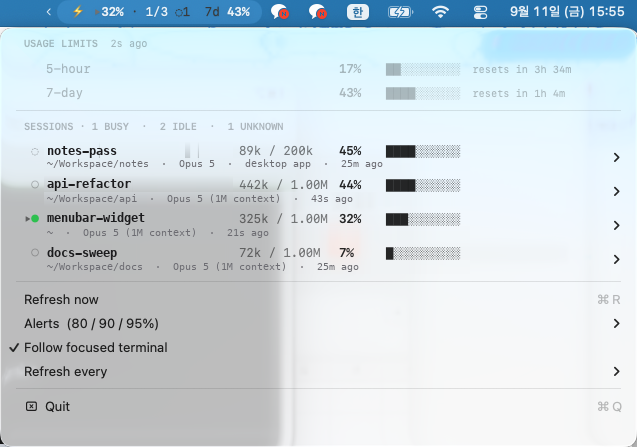

# Claude Context Monitor

**Context and limit monitoring for Claude Code, in the macOS menu bar.** · [한국어](README.ko.md)

Shows how full each running session's context window is, how much of your
5-hour and 7-day limits you have spent, and warns you before a session fills up.

> Built with Claude Code, because I needed it. I keep several sessions running
> at once and had no way to tell which one was about to run out of context, so I
> had Claude Code write the thing I was missing and verify it against my own
> machine. The support table below reports what was actually tested, not what
> was assumed.



```
⚡ ▸26% · 2/3 ◌1   7d 42%
```

| part | meaning |
|---|---|
| `▸` | following the terminal tab you are looking at — absent means it is showing the fullest session instead |
| `26%` | that session's context window usage |
| `2/3` | 2 of 3 sessions working; only sessions that report a state are counted |
| `◌1` | 1 more session whose busy/idle state is unknown |
| `7d 42%` | weekly limit used |

Each session has a submenu to copy its id or `claude --resume` command, open its
working directory, or reveal its transcript.

## Requirements

- macOS 13 or newer
- Claude Code, recent enough to write `~/.claude/sessions/`
- Command line tools for the Swift compiler: `xcode-select --install`

## Install

```sh
brew trust --tap ErrantKim/tap
brew install ErrantKim/tap/claude-context-monitor
claude-context-monitor-setup
```

Homebrew treats every third-party tap as untrusted. It currently only warns,
but says it will stop allowing untrusted taps in a later release, so the trust
line is worth running either way.

Or from source:

```sh
git clone https://github.com/ErrantKim/claude-context-monitor.git
cd claude-context-monitor
./install.sh
```

Either way it builds from source on your machine, which is also why there is no
Gatekeeper prompt to click through. The source install builds the app, installs it to `~/Applications`, registers it to start at
login, and points Claude Code's status line at the collector inside the bundle.
**The checkout is not needed afterwards** — nothing runs from it.

macOS will ask for two optional permissions:

- **Notifications**, for threshold alerts.
- **Automation**, the first time it reads which terminal tab is in front. Deny
  it and you simply lose the `▸` focus indicator.

To update, pull and run `./install.sh` again. To remove:

```sh
./uninstall.sh
```

Uninstall restores whatever status line you had before, deletes the app, the
launch agent and the cache, and leaves `~/.claude` and your own push script
alone.

## What works where

| | session list | context | 5h / 7d limits | alerts | focus `▸` |
|---|---|---|---|---|---|
| **iTerm2** *(verified)* | ● busy / ○ idle | exact | yes | yes | **yes** |
| **PyCharm terminal** *(verified)* | ● busy / ○ idle | exact | yes | yes | no |
| **Claude desktop app** *(verified)* | ◌ unknown | estimated | **not on its own** | yes | no |
| Other terminals — Terminal.app, Ghostty, Warp, WezTerm, VS Code | expected to work | exact | yes | yes | Terminal.app only |

Where the limits come from:

- **Focus tracking** asks the front application which tab is in front. Only
  iTerm2 and Terminal.app can answer that, so everywhere else the menu bar falls
  back to showing the fullest session. Nothing else degrades.
- **The desktop app** registers like any other session but writes no status
  field, so its busy/idle state is reported as unknown rather than guessed, and
  it is left out of the `2/3` ratio. Its context is read from the transcript
  instead of the status line — close, but not exact.
- **Limits need one terminal session.** They arrive only through the status
  line, which the desktop app never renders. The numbers are account-wide and so
  already include desktop usage, but with only the desktop app open nothing
  refreshes them; the dropdown then marks them stale in orange.

## Configuration

Everything lives in the menu.

| item | |
|---|---|
| **Alerts** | the whole feature, session context and weekly limit separately, the thresholds, and the push script |
| **Follow focused terminal** | turn the `▸` behaviour off; the menu bar then always shows the fullest session |
| **Refresh every** | 1 / 3 / 5 / 10 minutes for the full sweep |

The refresh interval only governs the full sweep. Context usage and busy/idle
follow file watchers and land in under a second regardless.

## Alerts

Off by threshold, not by noise: each level fires once per session and re-arms
only when usage falls back below the lowest one, so a session sitting at 82%
warns you once, not every minute. Default thresholds are 80 / 90 / 95%.

### Push script

Alerts can be handed to any executable you choose — **Alerts → Push script…**,
or drop one at the default `~/.claude/widget-notify`. This is the extension
point: the app makes no network requests itself, so anything that leaves your
machine leaves through your script.

It is called once per alert with the message as `$1` and a JSON object on stdin:

```jsonc
{
  "kind": "context",            // "context" | "limit"
  "level": 90,                  // the threshold that was crossed
  "percent": 91,                // actual usage when it fired
  "message": "context 91% · V3 설계",
  "at": 1789109038,             // unix seconds
  "session": {                  // "context" only
    "id": "0c972047-…",
    "name": "V3 설계",
    "cwd": "/Users/you/project",
    "model": "Opus 5 (1M context)",
    "entrypoint": "cli",        // "cli" | "claude-desktop" | …
    "tokens": 912345,
    "window": 1000000
  }
}
```

```jsonc
{
  "kind": "limit",
  "level": 80,
  "percent": 85,
  "window": "seven_day",
  "resets_at": 1789113600,      // unix seconds
  "message": "weekly limit 85% used",
  "at": 1789109038
}
```

Ignore stdin if `$1` is all you need. The payload is small enough to sit in the
pipe buffer, so a script that never reads it will not block:

```sh
#!/bin/sh
curl -fsS --max-time 5 -d "$1" https://ntfy.sh/your-topic
```

A macOS banner never reaches a phone or watch, which is what this is for.

## How it works

Everything is local. No credentials are read and no network requests are made.

- **`~/.claude/sessions/*.json`** — the session registry: pid, name, directory,
  busy/idle. Watched with a file-system source, so state changes appear in under
  a second rather than on the refresh interval.
- **The status line** — Claude Code hands its own numbers to a status line
  script on every render: `rate_limits.five_hour` and `.seven_day`, context
  usage, model, cost. `cc-widget-statusline` caches them under
  `~/.claude/widget-cache/`. This is the only passive local source for limits;
  they are not written anywhere else, and reading them any other way would mean
  taking your OAuth token out of the keychain.
- **`~/.claude/projects/*/*.jsonl`** — transcripts, read only for sessions that
  produce no status line. Only the head and tail of each file are parsed, so a
  40 MB transcript costs no more than a small one.

If you already had a status line, install.sh keeps it: the command is saved and
the collector runs it, printing its output instead of its own.

## Command line

The app prints the same data as text:

```sh
~/Applications/ClaudeContextMonitor.app/Contents/MacOS/ClaudeContextMonitor --print
```

## Troubleshooting

**The icon is missing.** A menu bar manager — Vanilla, Bartender, Ice — may have
it in the hidden section. Hold ⌘ and drag the icon to the visible side of the
separator; the position is remembered.

**No `▸`, ever.** Either the front terminal is not iTerm2 or Terminal.app, or
automation access was denied: System Settings → Privacy & Security → Automation.
Rebuilding changes the ad-hoc signature, so macOS may ask again after an update.

**Limits say "no data yet" or go orange.** They only refresh while a terminal
session renders its status line. Open one, or accept that desktop-app-only
usage leaves the last known figures in place.

**A session shows `◌`.** It registered without a status field — the desktop app
does this. Its state is genuinely unknown, so it is shown as such instead of
being guessed at.

## Layout

```
src/app.swift          the menu bar app
src/statusline.swift   the status line collector
build.sh               builds both into build/ClaudeContextMonitor.app
install.sh             builds, installs, registers at login
setup.sh               wires an installed app into Claude Code
uninstall.sh           reverses all of it
```

## License

MIT.
